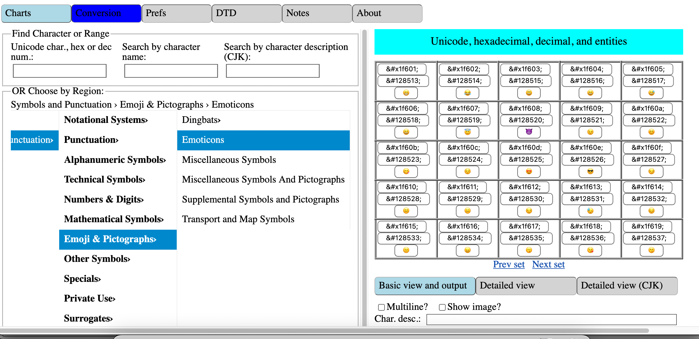
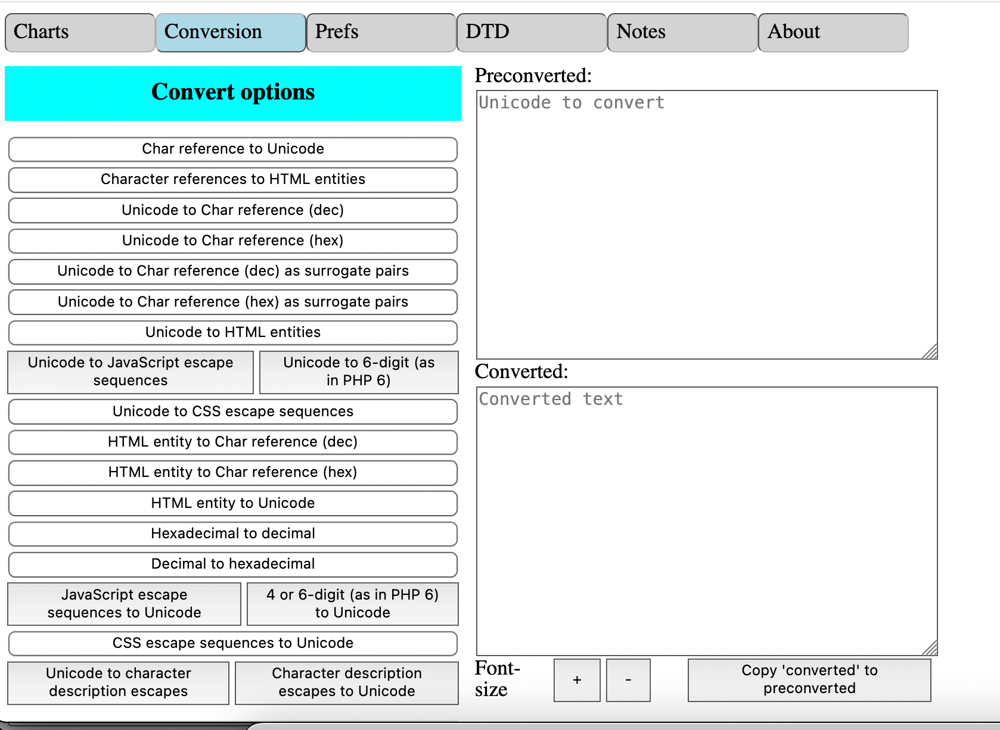
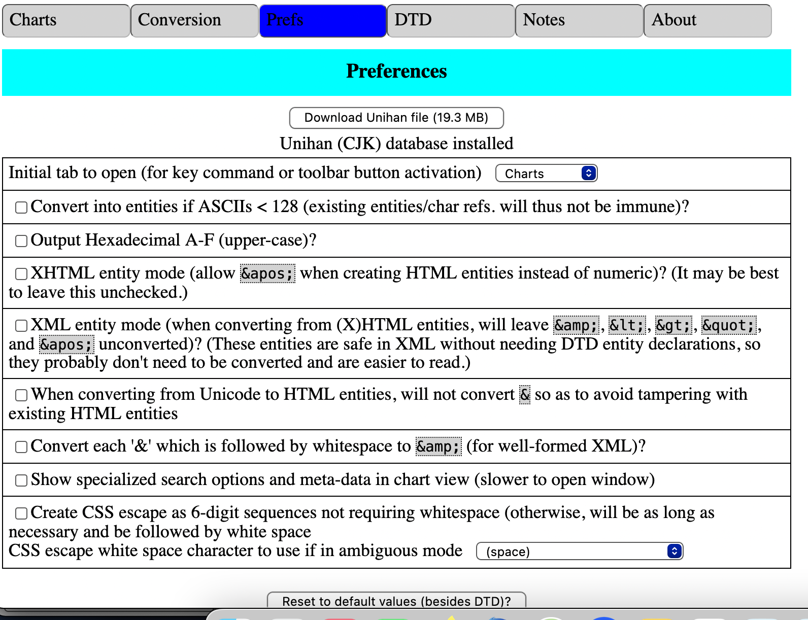
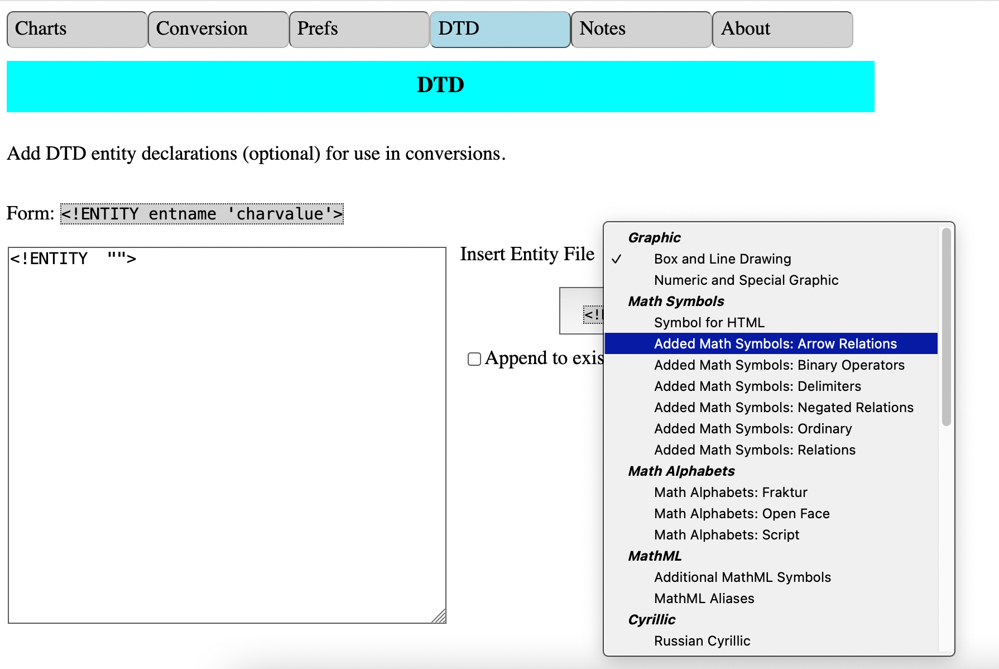

# unicode-input-toolconverter

**Work in progress! (Still restoring from old browser add-on.)**

A webextensions add-on (Firefox, Chrome) to allow selection of Unicode
characters by a variety of means and conversion between various
Unicode representations such as HTML/XML entities, numeric
character references, etc.

## Screenshots

## Possible to-dos

1. Improve slow **font retrieval**
1. Add `intl-dom`
    1. Get i18n completed (only en-US, hu-HU, pt-BR, sv-SE were completed)
1. **Protocol handler**:
  <https://developer.mozilla.org/en-US/docs/Mozilla/Add-ons/WebExtensions/manifest.json/protocol_handlers>
1. Various modules, some already in `vendor`, could be
    **moved to own npm package**
1. Convert
    [XUL-based add-on](https://addons.mozilla.org/en-US/firefox/addon/unicode-input-toolconverter/)
    to **webextensions** and complete HTML conversion
1. Conversion to/from **6-digit JavaScript escapes**
1. When browsing by script, have **option to update script location** when one
    uses next/prev
1. Utilize column browser also for **blocks/categories** (also use in
    `filebrowser-enhanced`!)
1. **Get ideas from charpick** (GPL3-licensed):
    <https://github.com/brettz9/charpick>?
1. Allow adding specific characters or sequences thereof to global system key
    commands
