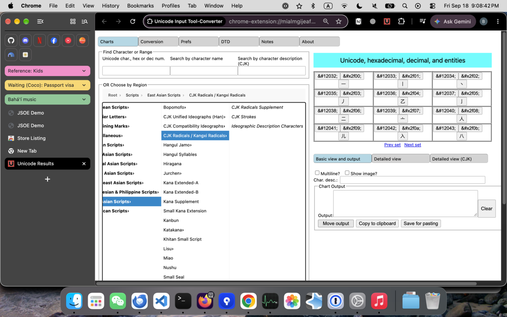
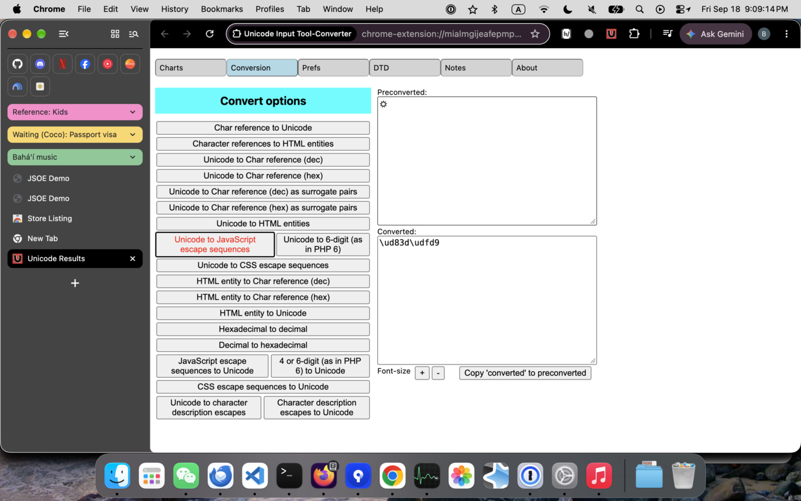
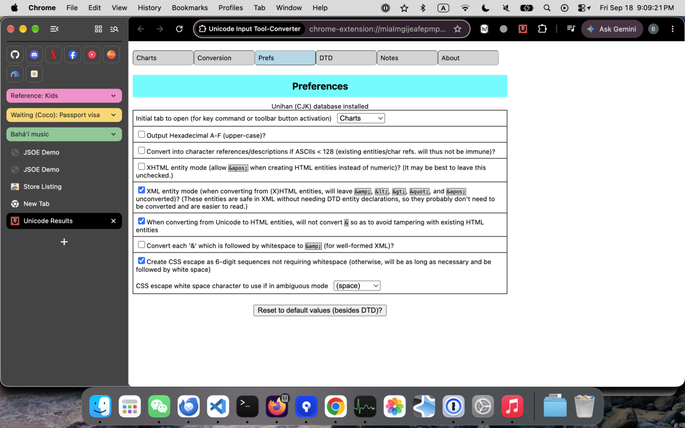
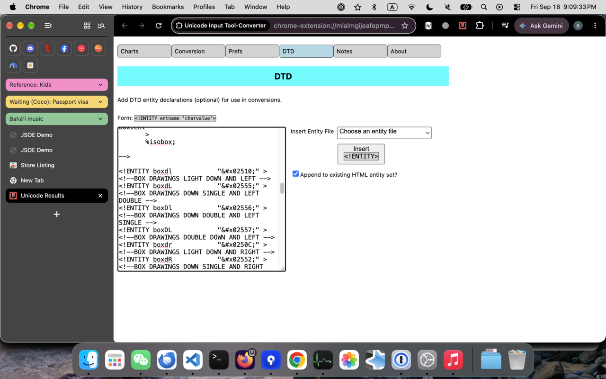

# unicode-input-toolconverter

A web app and webextensions add-on (Firefox, Chrome) to allow selection
of Unicode characters by a variety of means and conversion between various
Unicode representations such as HTML/XML entities, numeric
character references, etc.

See the [Demo](https://unicode-input-toolconverter-c5ug.vercel.app/browser_action/?serviceWorker=1)
<!--
[Demo](https://brettz9.github.io/unicode-input-toolconverter/browser_action/index-pages.html).
-->

## Screenshots

## History

This project had originally found life as a
[XUL-based Firefox add-on](https://addons.mozilla.org/en-US/firefox/addon/unicode-input-toolconverter/),
but XUL support was dropped in Firefox.

## Developing

1. To build: `npm run copy && npm run rollup`

## High priority to-dos

## To-dos - medium priority

1. ONGOING: Get **l10n** completed (only en, hu-HU, pt-BR, sv-SE were completed)
1. Cypress tests and coverage
1. Check `protocol_handlers` working once Chrome has in stable; e.g., use `ext+unicode:find?char=é`

1. **Protocol handler**:
    <https://developer.mozilla.org/en-US/docs/Mozilla/Add-ons/WebExtensions/manifest.json/protocol_handlers>
1. Compatibility with WebAppFind AtYourCommand so can **receive `postMessage`**
    to prepopulate entity conversion or chart item to browse
1. After HTML conversion, restore as browser add-on, but as **webextensions**
    1. Allow adding specific characters or sequences thereof to global system
        **key commands**

1. Conversion to/from **6-digit JavaScript escapes**
1. Create (reactive) **Web Components** (hyperHTML?) so that besides internal
    clarity, could reuse as pop-up script browser or character picker
1. Make **in-place context-menu-activated textbox conversions**
1. Improve slow **font retrieval**; need to do equivalent for
    other OS' or at least disable for them; <https://github.com/foliojs/font-manager>,
    <https://github.com/oldj/node-font-list> (though see <https://github.com/oldj/node-font-list/pull/5>)

## Lower-priority to-dos

1. Could display scripts on map (or col. browser) of which are RTL, what
    languages and scripts herald from that region, etc.
1. When browsing by script, have **option to update script location** when one
    uses next/prev
1. `unicode` or `utils` modules could be **moved to own npm package**
1. Utilize column browser also for **blocks/categories** (also use in
    `filebrowser-enhanced`!); could even replace chart
1. Offer **minimal character picker window**
